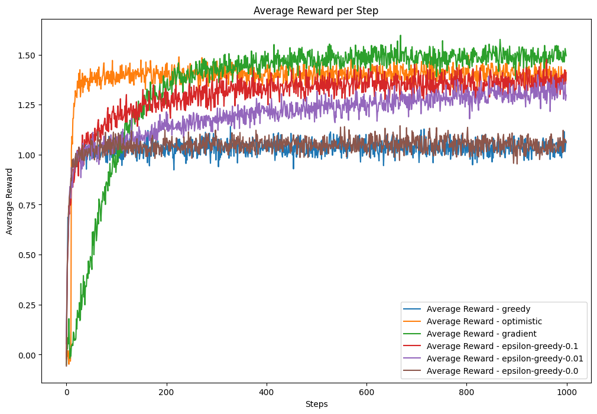
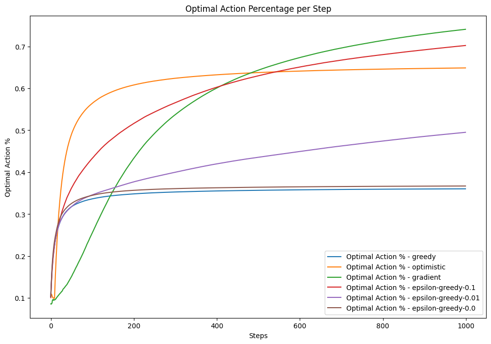
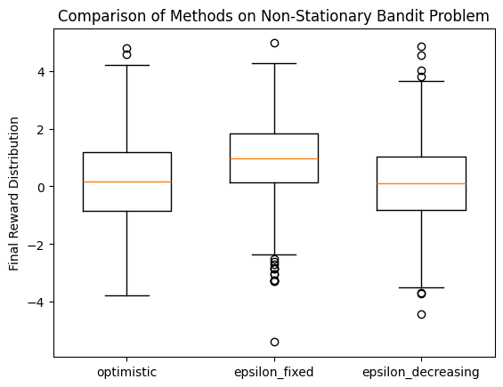

# Reinforcement-A1

This project is focused on using reinforcement learning method for project 1 for DSCI-6650

The main focus is on bandit problem. The task is descriped as below:

Part 1: The task involves solving a k-armed bandit problem with 10 arms, each having normally distributed rewards with unknown means. The goal is to learn the expected rewards for each arm using four different methods: (1) a greedy algorithm with non-optimistic initial values, (2) an epsilon-greedy algorithm with varying epsilon values, (3) a greedy algorithm with optimistic initial values, and (4) a gradient bandit algorithm with different learning rates. For each method, the performance is evaluated over 1000 bandit problems by tracking the average reward and the percentage of optimal actions taken at each time step.

Part 2: The task is to address non-stationary modifications of the k-armed bandit problem, where reward distributions change over time either gradually or abruptly. For gradual changes, two scenarios are considered: (1) a drift change where the mean parameters follow "u*t = u*{t-1} + epsilon*t" with "epsilon_t ~ N(0, 0.001^2)", and (2) a mean-reverting change where "u_t = k \* u*{t-1} + epsilon_t" with "k = 0.5" and "epsilon_t ~ N(0, 0.01^2)". For abrupt changes, at each time step, with a probability of 0.005, the means of the reward distributions are permuted. The evaluation involves comparing three methods: (1) an optimistic greedy approach, (2) epsilon-greedy with a fixed step size, and (3) epsilon-greedy with a decreasing step size. These methods are tested over 1000 repetitions of the non-stationary problems, and the distribution of average rewards at a terminal step (e.g., after 10,000 or 20,000 steps) is analyzed using box plots. The algorithm that yields the most favorable reward distribution at the terminal step is considered preferable. Pilot runs are recommended to fine-tune parameters before the main experiments.

